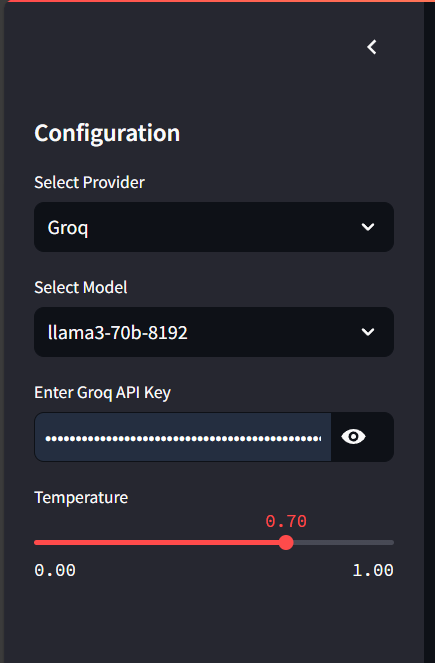
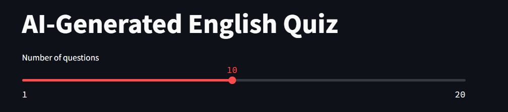
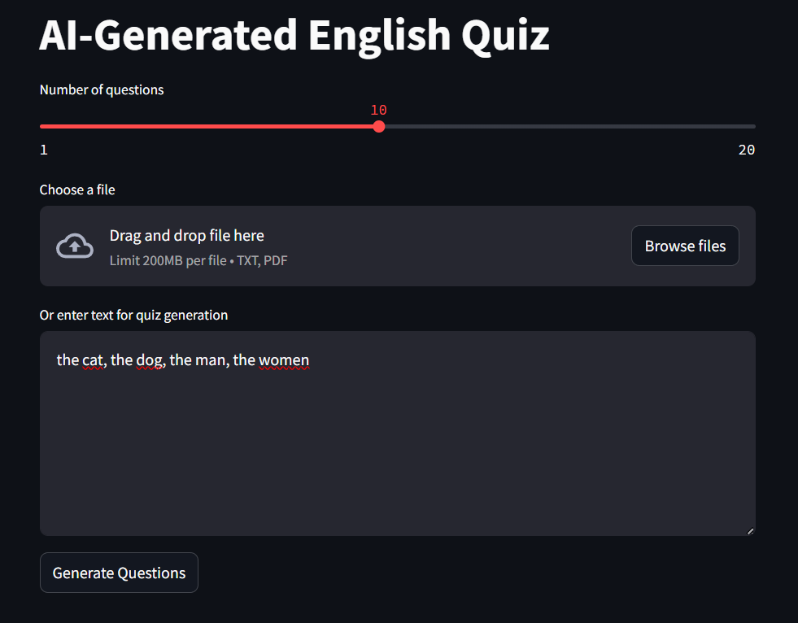
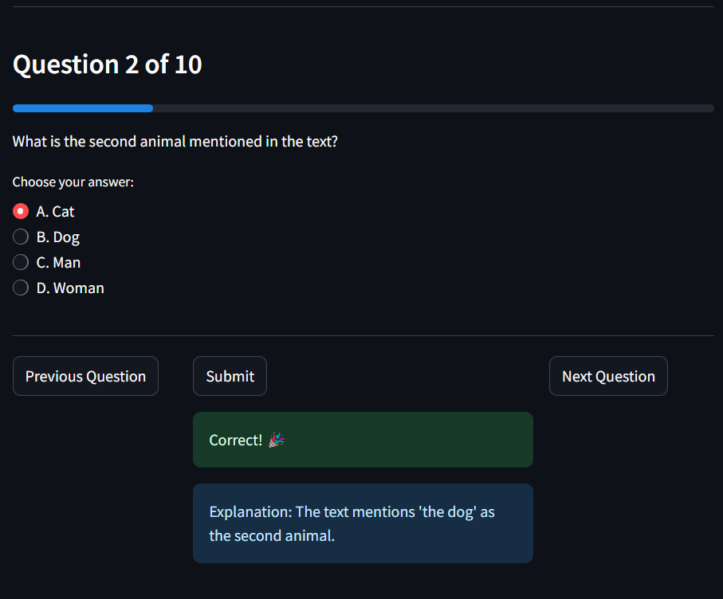

# 🎓 AI-Generated English Quiz

An interactive, AI-powered English quiz generator using Streamlit and Google's Gemini AI model. Perfect for educators, students, and anyone looking to enhance their English skills!

## 🌟 Features

- 🤖 AI-generated questions from any given text
- 📝 Multiple-choice quiz format
- 🖥️ User-friendly interface with Streamlit
- 📊 Real-time scoring and feedback
- 🔄 Option to restart and generate new quizzes

## 🛠️ Installation

1. **Clone the repository**
   ```
   git clone https://github.com/yourusername/ai-english-quiz.git
   cd ai-english-quiz
   ```

2. **Set up a virtual environment** (optional, but recommended)
   ```
   python -m venv venv
   source venv/bin/activate  # On Windows, use `venv\Scripts\activate`
   ```

3. **Install required packages**
   ```
   pip install -r requirements.txt
   ```

## 🚀 Usage

1. **Run the application**
   ```
   streamlit run run.py
   ```

2. ### Using the Quiz Generator

**Select Model and Enter API Key**

- First, choose the AI provider and model from the available options.
- Then, enter the corresponding API key for the selected provider.


**Adjust the Number of Questions**

- Use the slider to set the number of questions you want to generate for the quiz.


**Select the Knowledge Base**

- You can upload a document (TXT or PDF) containing the content you want to review.
- Alternatively, you can directly input the content into the provided text area.


**Generate Questions**

- Once everything is set up, click on the "Generate Questions" button.
- The application will generate the quiz questions based on the provided content.



## 📁 Project Structure

```
ai_english_quiz/
│
├── src/
│   ├── config.py            # Configuration settings
│   ├── models/
│   │   └── question_model.py  # Question data model
│   ├── services/
│   │   └── quiz_service.py    # Core quiz generation logic
│   └── ui/
│       └── main_app.py        # Streamlit UI
│
├── tests/                   # Unit tests
├── data/                    # Sample data (if any)
├── requirements.txt         # Project dependencies
├── README.md                # Project documentation
└── run.py                   # Entry point to run the application
```

## 🧪 Running Tests

To run the unit tests:

```
python -m unittest discover tests
```

## 🤝 Contributing

Contributions are welcome! Here's how you can contribute:

1. Fork the repository
2. Create a new branch (`git checkout -b feature/AmazingFeature`)
3. Make your changes
4. Commit your changes (`git commit -m 'Add some AmazingFeature'`)
5. Push to the branch (`git push origin feature/AmazingFeature`)
6. Open a Pull Request

## 📜 License

This project is licensed under the MIT License - see the [LICENSE](LICENSE) file for details.

## 🙏 Acknowledgements

- [Streamlit](https://streamlit.io/) for the amazing web app framework
- [Google Gemini AI](https://deepmind.google/technologies/gemini/) for powering our question generation
- [Langchain](https://python.langchain.com/) for simplifying AI model interactions

## 📞 Contact

Hoang Anh Vu - Gmail : hoanganhvu933@gmail.com

Project Link: [https://github.com/Hoanganhvu123/ai-english-quiz](https://github.com/Hoanganhvu123/ai-english-quiz)

---

⭐️ If you find this project useful, please give it a star on GitHub! ⭐️